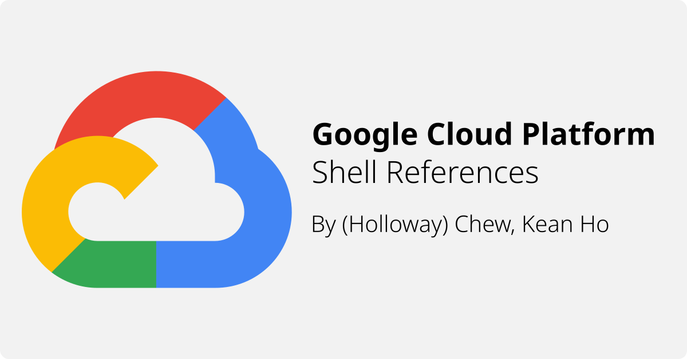

# Google Cloud Platform Cloud Shell Notes

These are the composite list of command notes developed overtime by interacting
with Google Cloud Platform. The repository's purpose is to record all the
commands for their implications and building new tools that is compatible with
Google Cloud Platform.

Most commands retained itself in `shell` or `bash` script format to preserve
its originality.

## When the Repository Started
By directly pariticating and fulfills QwikLab training labs and challenge lab.
From top to bottom, Qwiklab did prepares quite a good self-pace, **very hands-on**,
developer oriented lab practices and challenges.

To fulfill their challenges, you need to build up your own notes and construct
your answer accordingly.

## Self-Service Repositories
These are recipes compiled by many profressionals to create some great outcome.
While they can't be directly integrated into this repository, it is great to
link them up in case anyone wants to refer to it in the future.

1. Manual GKE handling -
   https://github.com/GoogleCloudPlatform/gke-migration-to-containers.git
2. GKE Network Policying -
   https://github.com/GoogleCloudPlatform/gke-network-policy-demo.git
3. GKE RBAC IAM -
   https://github.com/GoogleCloudPlatform/gke-rbac-demo.git
4. GKE Securing Application -
   https://github.com/GoogleCloudPlatform/gke-security-scenarios-demo
5. AI Training Intro - See `self-paced-lab/ai-platform-qwikstart` -
   https://github.com/GoogleCloudPlatform/training-data-analyst

## License
This repository is licesed under MIT License (See [LICENSE](license) file)
to promote further learning with Google Cloud Platform.
